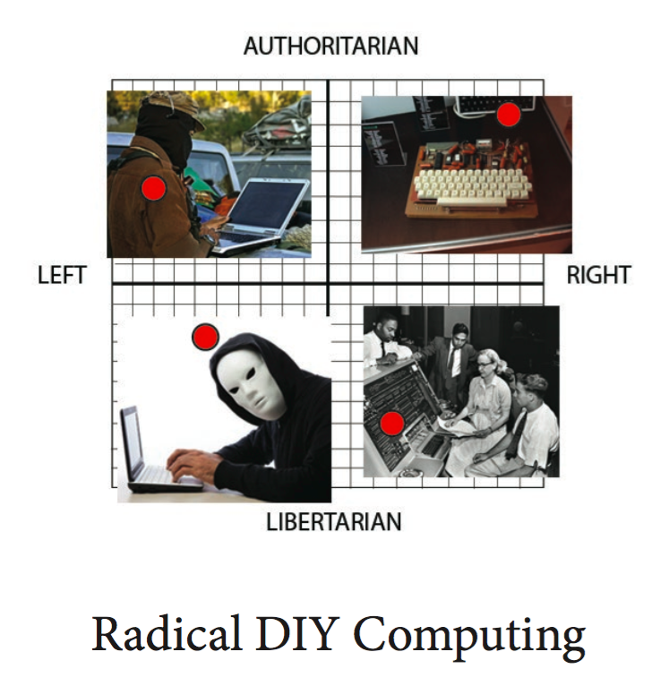

# RadicalDIYComputing_workshop

## About

This repository contains the lesson plan, zine and presentation from the Skillshare Workshop *Radical DIY Computing* hosted and supported by Side Street Projects at The Armory Center For The Arts, Pasadena

## Contents
* [PDF](https://github.com/lee2sman/RadicalDIYComputing_workshop/blob/master/radical_computing_presentation_ver1.pdf) with slides of presentation (7mb)
* [Zine text](https://github.com/lee2sman/RadicalDIYComputing_workshop/blob/master/RadicalComputing_zine_text.md)
* [PDF of Zine ](https://github.com/lee2sman/RadicalDIYComputing_workshop/blob/master/workshop%20zine%20C2.pdf)
* [Workshop Lesson Plan Outline](https://github.com/lee2sman/RadicalDIYComputing_workshop/blob/master/WorkshopLessonPlan.md)
* [Resources and Links](https://github.com/lee2sman/RadicalDIYComputing_workshop/blob/master/Resources.md) to learn more
* [Notes For Educators](https://github.com/lee2sman/RadicalDIYComputing_workshop/blob/master/NotesForEducators.md)

## Goals
* Build a Linux computer with the CHIP computer as a base and pre-installed ChipOS
* Learn about the history of free and open source computing and culture
* Feel more confident looking under the hood of a computer and its operating system and tinkering with it
* Understand the history and philosophy and tools of Linux
* Review software and example projects using CHIP
* Discuss purpose and possibilities for decentralized computing, darknets and mesh networking, piratebox, etc
* Learn about resources for further learning, community and exploration
* Gain basic understanding of the Terminal commandline, how to access and enter basic commands, and understand its purpose and *philosophy*

## ADMIN
* Your workshop leaders are [Lee Tusman](http://twitter.com/2sman2sman) and [Echo Theohar](http://twitter.com/eskyet_text)
* [Side Street Projects](http://sidestreet.org) organized and supported the kickoff Skill Share workshop. Side Street hosts a series of upcoming [Skill Shares](http://sidestreet.org/skills)
* Comments, corrections or questions welcome.
* Thank you to everyone who participated in our Skill Share.
